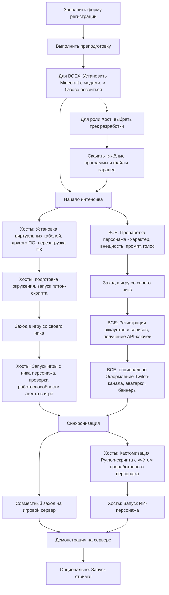

# План интенсива по созданию AI-стримерши

> **Цель:** Запустить собственного ИИ-персонажа с уникальной личностью — персонализированного автономного агента для прямых трансляций

Каждая команда запускает собственного AI-персонажа на основе готового бейзлайна!

Задача - повторить нашу инструкцию. Если вы впервые зашли сюда, начните с чтения [Вводных](#вводные), это обязательно, чтобы всё получилось!

## Содержание

- [План интенсива по созданию AI-стримерши](#план-интенсива-по-созданию-ai-стримерши)
  - [Содержание](#содержание)
  - [Вводные](#вводные)
    - [👥 Роли участников](#-роли-участников)
    - [Схема](#схема)
  - [Обязательная преподготовка ДЛЯ ВСЕХ](#обязательная-преподготовка-для-всех)
  - [1. Роль Хост: обязательная подготовка](#1-роль-хост-обязательная-подготовка)
    - [1.1 Выбрать трек хоста заранее](#11-выбрать-трек-хоста-заранее)
    - [1.2 Скачайте заранее](#12-скачайте-заранее)
    - [1.3 Установите программы](#13-установите-программы)
    - [1.3.1](#131)
      - [1.3.2 Для треков выше Standart](#132-для-треков-выше-standart)
  - [Блоки 2-5. Основной этап](#блоки-2-5-основной-этап)
  - [Блок 2. Запуск ИИ-персонажа (Хост)](#блок-2-запуск-ии-персонажа-хост)
    - [2.1 Настройка программ](#21-настройка-программ)
    - [2.2 Питонячья часть](#22-питонячья-часть)
    - [2.3 Кастомизация](#23-кастомизация)
    - [2.4 Запуск](#24-запуск)
  - [Блок 3. Проработка личности персонажа](#блок-3-проработка-личности-персонажа)
    - [3.1 База](#31-база)
      - [3.1.1 Ник персонажа](#311-ник-персонажа)
      - [3.1.2 Характер описание](#312-характер-описание)
        - [3.1.3 Примеры ответов персонажа в разных сценариях](#313-примеры-ответов-персонажа-в-разных-сценариях)
    - [3.2 ПРОМПТ персонажа](#32-промпт-персонажа)
    - [3.3 Внешность персонажа](#33-внешность-персонажа)
    - [3.4 Голос персонажа](#34-голос-персонажа)
  - [Блок 4. Аккаунты и сервисы](#блок-4-аккаунты-и-сервисы)
    - [4.1 Twitch аккаунт](#41-twitch-аккаунт)
    - [4.2 Twitch dev](#42-twitch-dev)
    - [4.3 LLM API](#43-llm-api)
    - [4.4 Донаты](#44-донаты)
  - [Блок 5. Оформление](#блок-5-оформление)
    - [5.1 Оформление канала](#51-оформление-канала)
  - [ОБЩЕЕ TODO](#общее-todo)

## Вводные

В процессе знакомимся с **Twitch API**, **VTube Studio**, **виртуальными аудиокабелями**, **AI DevOps** по технической части, по софтам - создание образа персонажа, промпт-инжиниринг.

**Название** команды - ник вашего ИИ-персонажа.

В каждой команде **обязательно** должен быть человек с ролью **Хост** — тот герой, кто запускает стримершу.

**Результат:** N уникальных AI-стримеров, работающих в реальном времени на одном Minecraft-сервере (где N - число команд, успешно прошедших интенсив).

### 👥 Роли участников

> В каждой команде **обязательно** должен быть **Хост** — человек, который запускает стримершу.

- работаем **индивидуально** по возможности
- в команде ТОЛЬКО если друзья/нет физической возможности быть хостом/есть другая супер-весомая причина.
- на одном человеке может быть несколько ролей;
- роли могут пересекаться.

| Роль | Описание | Основные задачи |
|------|----------|----------------|
| **🎯 Хост** | Запускает персонажа | Подготовка окружения, запуск всех систем |
| **🎨 Креативщик** | Креативный специалист | ImageGen, оформление каналов, PromptGen |
| **📝 Регистратор** | Учётные записи в сервисах | Создание Twitch-аккаунта, получение API-ключей, заполнение таблиц |
| **📹 Папарацци** | Документалист, нарезчик | Запись моментов со стрима, создание клипов, монтаж highlights |
| **👀 Наблюдатель** | Наблюдать за происходящим, комментировать | Просто весело провести время, посидеть с нами в игре, покомментировать персонажей |

### Схема



## Обязательная преподготовка ДЛЯ ВСЕХ

Карточка задачи:

| ID | ID pre | Роли | Важность |
|-----|-----|-----|---|
| Prep | - | ВСЕ | Обязательно |

> Пока что, если видите TODO в инструкциях, можно ориентироваться на [СТАРУЮ](docs/INTENSIVE_PLAN_OLD.md) схему.

Обращаем внимание, что вы заполняли форму [ПРЕДВАРИТЕЛЬНОЙ](https://forms.gle/cPXF1JUPXp2bSxTK7) регистрации (из поста в TG), здесь ниже будет ссылка на форму [ОСНОВНОЙ](https://docs.google.com/forms/d/1qnJxamwzLhPryon-uBwYUslJOP-KU-YltWA_G3pDvo8/edit) обязательной регистрации (но заполнять её лучше после выполнения пунктов ниже).

Перед интенсивом всем участникам обязательно нужно сделать следующее:

1. Определитесь с вашей РОЛЬЮ участника
2. Придумайте ваш собственный уникальный ник, если его нет
   - На английском, от 4 до 12 символов, только буквы и цифры
3. Придумайте ник вашему персонажу
4. Заполните [формочку](https://forms.gle/VxHGzWpPp7PaNec78) **ОСНОВНОЙ** регистрации
5. (*Крайне желательно*) Установите **Minecraft** с **модами** согласно инструкции и минимально освойтесь ([инструкция](docs/instructions/Minecraft.md))

    Поставьте необходимый модпак, попробуйте зайти на какой-нибудь сервер, освоить минимальные основы

## 1. Роль Хост: обязательная подготовка

Перед интенсивом нужно **ОБЯЗАТЕЛЬНО** заранее ВЫБРАТЬ **ТРЕК** ХОСТА и **СКАЧАТЬ** ТЯЖЕЛЫЕ ФАЙЛЫ, об этом сейчас тут расскажу. Иначе не успеете к финалу интенсива `:(`

Так как участник под ролью хоста запускает у себя ИИ-персонажа, нужно иметь подходящее для этого устройство. Минимальные системные требования:

- Более 10G RAM
- Место на диске более 50 G
- Интернет не медленнее 10 мегабит
- OS: мы пробовали на маке, винде и линуксе, можно везде, НО проще всего на винде, а на маке можно потерять часть функций с Rich TTS.

### 1.1 Выбрать трек хоста заранее

| ID    | ID pre | Роли | Важность |
|-------|----|------|-------------|
| 1.1   | Prep | Хост | Обязательно |

Выберите трек разработки исходя из спеков вашего компа или ноута.

> [!CAUTION]
> Это ТРЕК для роли ХОСТА, не путать с РОЛЯМИ участников!

Таблица треков:

| Трек | Фичи | Требования |
|---|---|---|
| **1. Standart** | Игровой персонаж, простой TTS и STT, LLM по API | Минимальные требования |
| **2. Rich** | **Интонационный TTS**, простой STT, LLM по API. Рекомендуемый трек, т.к. вы сможете легко кастомизировать ГОЛОС вашего персонажа! | GPU с VRAM более **4G**, поддержкой CUDA 12+ |
| **3. Ultra** | **Локальная ролевая LLM**, Интонационный TTS, простой STT  | **NVIDIA** GPU с VRAM **16G** и более |
| **4. Maximus** | Локальная ролевая LLM, Интонационный TTS, **Качественный** STT | NVIDIA GPU с VRAM **25G** и более |

### 1.2 Скачайте заранее

| ID | ID pre | Роли | Важность |
|-----|----|-----|---|
| 1.2.1 | 1.1 | Хост | Обязательно |

Сначала можете просто накачать установщиков и программ.

1.2.1 Базовые программы:

- Если нет архиватора, скачайте [7-zip](https://www.7-zip.org/)
- [Виртуальные кабели](https://vb-audio.com/Cable/) под мак и винду
- [VTube Studio](https://store.steampowered.com/app/1325860/VTube_Studio/) из [Steam](https://store.steampowered.com/about/)
  - Также удостовертесь, что есть стимовский аккаунт
- [OBS](https://obsproject.com/)

1.2.2 Для треков выше Standart:

| ID | ID pre | Роли | Важность |
|-----|----|-----|---|
| 1.2.2 | 1.2.1 | Хост, ТРЕКИ выше Standart - Rich/Ultra/Maximus | Обязательно |

- Nvidia Cuda [12.9](https://developer.nvidia.com/cuda-12-9-0-download-archive) 3.1 G
- Nvidia [CuDNN 9.15](https://developer.nvidia.com/cudnn-9-15-0-download-archive) 700 MB
- Docker Desktop

### 1.3 Установите программы

| ID | ID pre | Роли | Важность |
|-----|----|-----|---|
| 1.3 | 1.2.1 | Хост | Обязательно |

### 1.3.1

| ID | ID pre | Роли | Важность |
|-----|----|-----|---|
| 1.3.1 | 1.3 | Хост | Обязательно |

- Установите виртуальный звуковой кабель ([Windows](docs/instructions/VirtualAudioCable-Windows.md), [Mac](docs/instructions/VirtualAudioCable-Mac.md), [Linux](docs/instructions/VirtualAudioCable-Linux.md))
  - **КРИТИЧНО: ПЕРЕЗАПУСТИТЕ КОМП ПОСЛЕ УСТАНОВКИ!!!**
- VTube Studio установите из Steam
- Установите мод AutoClef на Minecraft в папку mods ([инструкция](docs/instructions/Minecraft.md#основной-мод-autoclef))
  - (в идеале) Базово освойтесь с ним

<details><summary>Если ставили CUDNN для WINDOWS (КРИТИЧНО!)</summary>

Нужно добавить CUDNN в Path (переменные среды и путь) Windows, как правило установщики Nvidia этого не делают как нужно!!
Если этого не сделать, будут проблемы с запуском STT модели на CUDA.

как добавить база есть тут <https://remontka.pro/add-to-path-variable-windows/>

в PATH нужно добавить путь к bin от cudnn:

`C:\Program Files\NVIDIA\CUDNN\v9.15\bin\12.9`

ИЛИ

`C:\Program Files\NVIDIA GPU Computing Toolkit
\CUDNN\v9.15\bin\12.9`

(перейдите в папку и проверьте какой у вас вариант, та папка, которая существует - та и правильная)

</details>

#### 1.3.2 Для треков выше Standart

| ID | ID pre | Роли | Важность |
|-----|----|-----|---|
| 1.3.1 | 1.2.2, 1.3 | Хост, треки ВЫШЕ Standart | Обязательно |

Если не установлен Docker:

Ранее вы скачали Docker (если следовали инструкции), установите его и перезапуститесь после установки.

Теперь скачаем заранее образ для нашего крутого интонационного TTS

```bash
docker pull fishaudio/fish-speech:v1.5.1-dev`
```

## Блоки 2-5. Основной этап

Этап начинается со знакомства, вот его план:

- Представляем организаторов, кратко ещё раз план интенсива, где вся инфа
- (опционально) Встречаемся в игре
- Показываем наших персонажей
- Финализируем распределение, кто запросил команду
- Начинаем работу

Соответственно основной этап - блоки 2-5 - мы с вами будем проходить вместе, СТРОГО следуем инструкциям и надеемся на лучшее, и если сложности, обращаемся к организаторам.

Здесь наш интенсив делится на 2 параллельные задачи:

- Блоки 2: по подготовке и запуску самой стримерши для Хоста
- Блоки 3-5: по проработке персонажа, регистрации сервисов и т.д. для любых ролей

Распределиться на задачи можно как угодно, но они должны идти параллельно. НО если участник в команде один (значит он же - хост) - придётся делать сначала 2, но прерываться на важные штуки из других блоков в процессе.

## Блок 2. Запуск ИИ-персонажа (Хост)

Ок, двигаемся дальше по плану

| ID | ID pre | Роли | Важность |
|----|----|------|-------------|
| 2  | 1.3.1 | Хост | Обязательно |

Участник под ролью **Хост** включает демку экрана для своей команды и поехали! Если сложности (а они 9999% будут) - зовём организаторов, а пока они не пришли, пытаемся справиться командой!

> [!CAUTION]
> На этом этапе части **предподготовки** и **подготовки** должны быть *выполнены* для вашей **роли** и **трека**!
>
> Если не успели, вам придётся делать преподготовку прямо в процессе интенсива и тогда вы вряд ли успеете к финалу

### 2.1 Настройка программ

| ID | ID pre | Роли | Важность |
|----|----|------|-------------|
| 2.1  | 2 | Хост | Обязательно |

2.1.1 OBS Studio → [Инструкция по настройке](./instructions/OBS.md)

- Настраивать будем под Twitch, понадобится ключ трансляции для него

2.1.2 Настройка VTube Studio → [Инструкция по настройке](./instructions/VtubeModel.md)

### 2.2 Питонячья часть

| ID | ID pre | Роли | Важность |
|----|----|------|-------------|
| 2.2  | 2.1 | Хост | Обязательно |

*Если ссылка на репозиторий или файлы ещё не добавлена — уточни у организаторов, где взять.*

- Скачать репозиторий с [ДИСКА](https://drive.google.com/drive/folders/1pU-wM7Mpy7-rz89I3DkzB9JL6Q6Aq30c?usp=sharing) и засунуть его куда-то в норм место
  - по типу `C:/Repos/repo`
- Строго следовать инструкциям по установке В ФАЙЛАХ README репозитория
  - Центральный файл nettyan/README.md
  - В нём же есть ссылки где лежат инструкции по настройке, `repo/docs/help/...`

(репозиторий не на гите, так как это немного урезанная альфа версия нашей моно-репки ИИ-стримерши, мы не готовы пока его публиковать...)

### 2.3 Кастомизация

| ID | ID pre | Роли | Важность |
|----|----|------|-------------|
| 2.3  | 2.2 | Хост | По желанию |

2.3.1 Кастомизация VTube Studio-модели, скачивание своей модели

2.3.2 Кастомизация OBS сцены

2.3.3 Кастомизация кода в Python-скрипте (см. docs/customization.md в python-репозитории)

### 2.4 Запуск

| ID | ID pre | Роли | Важность |
|----|----|------|-------------|
| 2.4  | 2.3 | Хост | Обязательно |

## Блок 3. Проработка личности персонажа

Сделайте общий гугл док для удобства

### 3.1 База

#### 3.1.1 Ник персонажа

#### 3.1.2 Характер описание

##### 3.1.3 Примеры ответов персонажа в разных сценариях

- Убили в игре
- Победа в игре
- Оскорбили в чате
- Задали умный вопрос
- Издеваются и глумятся

### 3.2 ПРОМПТ персонажа

- Составьте промпт персонажа

- Потестите в Mistral chat

> Передайте финальный промпт Хосту, ему нужно закинуть это в personalities.yml!

### 3.3 Внешность персонажа

Сначала составьте описание внешности, ссылки на пару пикч-рефов мб

Ссылка на Steam workshop для Live2D модели вашего персонажа. **ПЕРЕДАЙТЕ ССЫЛКУ ХОСТУ**, пусть он поставит модель по инструкции (TODO)
> (можете поставить себе live2d и поэкспериментировать, если хотите, т.к. не все модели поддерживают движения лица, рта и т.п.)

### 3.4 Голос персонажа

> Если ваш Хост выбрал трек разработки Rich и выше, вы можете найти звуковые фрагменты для вашего персонажа, конвертировать в `.wav` файлы 48 kHz 16 bit mono (не критично, если не знаете, что это, просто переведите в `.wav` пусть даже онлайн конвертером), тогда ваш персонаж будет звучать так же, как эти звуковые фрагменты!

## Блок 4. Аккаунты и сервисы

TODO добавить в блок ссылки

### 4.1 Twitch аккаунт

Создать Twitch аккаунт, получить API ключ для стримов.

### 4.2 Twitch dev

Зарегистрировать приложение в Twitch dev, получить Client ID и Client Secret.

Могут быть проблемы с РУ номером, нужно несколько попыток попробовать или брать не РУ номер.

### 4.3 LLM API

API ключи (Mistral бесплатный и можно зарегать по РУ номеру), GROQ и GEMINI тоже крутые лимиты, но если есть *сервис для интернета другого региона*

### 4.4 Донаты

Настройка DonationAlerts, получение ссылки для внедрения в OBS

## Блок 5. Оформление

TODO
### 5.1 Оформление канала

Аватарка канала
Шапка канала
Описание канала

Аватарки

## ОБЩЕЕ TODO

[TODO для разработчиков интенсива]

1. - [ ] Добавить во все таблицы НЕОБХОДИМЫЕ ЗАДАЧИ с номерами и ссылками (заменить графу время на них)
2. - [ ] сделать норм инструкцию, чтобы несильно переплеталась!
   Пока что громоздко и тяжко
3. - [x] Добавить ссылки на существующие инструкции
4. - [x] Залить моды и репозиторий на диск
5. - [ ] Обновить инструкции
6. - [ ] Twitch dev
7. - [ ] Добавить инструкции
        - по LM Studio
        - По добавлению голоса