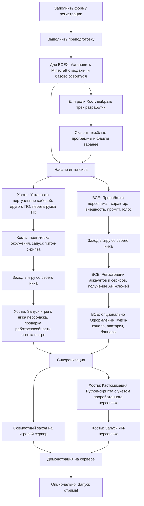

# План интенсива по созданию AI-стримерши

> **Цель:** Запустить собственную нейростримершу с уникальной личностью — персонализированного автономного агента для прямых трансляций

Каждая команда запускает собственного AI-персонажа на основе бейзлайна нейростримерши NetTyan!

В процессе знакомимся с **Twitch API**, **VTube Studio**, **виртуальными аудиокабелями**, **AI DevOps** по технической части, по софтам - создание образа персонажа, промпт-инжиниринг.

**Команды:** работаем **индивидуально** по возможности, в команде ТОЛЬКО если друзья/нет физической возможности быть хостом/есть другая супер-весомая причина.

**Название** команды - ник вашего ИИ-персонажа.

В каждой команде **обязательно** должен быть человек с ролью **Хост** — тот герой, кто запускает стримершу.

**Результат:** N уникальных AI-стримеров, работающих в реальном времени на одном Minecraft-сервере (где N - число команд, успешно прошедших интенсив).


## Содержание



## Вступление

### В чём ценность

Кому это надо (ЦА)

### Роли участников

TODO

## Обязательная преподготовка ДЛЯ ВСЕХ

Пока что где TODO в инструкциях можно ориентироваться на [СТАРУЮ](docs/INTENSIVE_PLAN_OLD.md) схему.

Перед интенсивом всем участникам обязательно нужно сделать следующее:

1. Определитесь с РОЛЬЮ участника
2. Придумайте ваш собственный уникальный ник, если его нет
   - На английском, от 4 до 12 символов, только буквы и цифры
3. Придумайте ник вашему персонажу
4. Установите Minecraft и минимально освойтесь (инструкция TODO)
5. Поставьте необходимый модпак, попробуйте зайти на какой-нибудь сервер, освоить минимальные основы (инструкция TODO) (модпак залить на диск TODO)

## 1. Роль Хост: обязательная подготовка

Перед интенсивом нужно ОБЯЗАТЕЛЬНО заранее ВЫБРАТЬ ТРЕК ХОСТА и СКАЧАТЬ ТЯЖЕЛЫЕ ФАЙЛЫ, об этом сейчас тут расскажу. Иначе гарантированно не успеете к финалу интенсива `:(`

Так как участник под ролью хоста запускает у себя ИИ-персонажа, нужно иметь подходящее для этого устройство. Минимальные системные требования:

- Более 10G RAM
- Место на диске более 50 G
- Интернет не медленнее 10 мегабит
- OS: мы пробовали на маке, винде и линуксе, можно везде, НО проще всего на винде, а на маке можно потерять часть функций с Rich TTS.

### 1.1 Выбрать трек хоста заранее

Выберите трек разработки исходя из спеков вашего компа или ноута.

> [!CAUTION]
> Это ТРЕК для роли ХОСТА, не путать с РОЛЯМИ участников!

Таблица треков:

| Трек | Фичи | Требования |
|---|---|---|
| **1. Standart** | Игровой персонаж, простой TTS и STT, LLM по API | Минимальные требования |
| **2. Rich** | **Интонационный TTS**, простой STT, LLM по API. Рекомендуемый трек, т.к. вы сможете легко кастомизировать ГОЛОС вашего персонажа! | GPU с VRAM более **4G**, поддержкой CUDA 12+ |
| **3. Ultra** | **Локальная ролевая LLM**, Интонационный TTS, простой STT  | **NVIDIA** GPU с VRAM **16G** и более |
| **4. Maximus** | Локальная ролевая LLM, Интонационный TTS, **Качественный** STT | NVIDIA GPU с VRAM **25G** и более |

### 1.2 Скачайте заранее

Сначала можете просто накачать установщиков и программ.

ПОКА ПРОСТО СКАЧИВАЕМ

ССЫЛКИ TODO

Базовые программы:

- Если нет архиватора, скачайте 7-zip
- Виртуальные кабели
- VTube Studio из Steam
- OBS

Для треков выше Standart:

- CUDA 12.9
- CUDNN NN.NN (+ проброс пути в PATH к нему в винде)
- Docker Desktop

### 1.3 Установите программы

Устанавливаем программы
TODO ссылки на инструкции

- Установите виртуальный звуковой кабель
  - **КРИТИЧНО: ПЕРЕЗАПУСТИТЕ КОМП ПОСЛЕ УСТАНОВКИ!!!**
- VTube Studio установите из Steam
- Установите мод AutoClef на Minecraft в папку mods
  - [ ] (в идеале) Базово освойтесь с ним

#### Для треков выше Standart

Если не установлен Docker:

Ранее вы скачали Docker, установите его и перезапуститесь после установки.

Теперь скачаем заранее образ для нашего крутого интонационного TTS

```bash
docker pull fishaudio/fish-speech:v1.5.1-dev`
```

## 2 и 3. Основной этап

Этап начинается со знакомства.

1. Представляем организаторов, и ещё раз кратко проговариваем план интенсива
2. Финализируем распределение, знакомимся с командами, примерно понимаем уровень подготовки и интересы
3. (опционально) Встречаемся в игре
4. (опционально) Мини-демонстрация существующего прототипа
5. Начало работы

Эту часть мы с вами будем проходить вместе, СТРОГО следуем инструкциям и надеемся на лучшее, и если не сложности, обращаемся к организаторам.

Здесь наш интенсив делится на 2 параллельные задачи:

- Пункт 2: по подготовке и запуску самой стримерши для Хоста
- Пункт 3: по проработке персонажа, регистрации сервисов и т.д. для любых ролей

Распределиться на задачи можно как угодно, но они должны идти параллельно. НО если участник в команде один (значит он же - хост) - придётся делать сначала 2, но прерываться на важные штуки из 3.

TODO подумать как сделать лучше, есть сложность:
ЗАДАЧИ переплетаются. Когда хост поставит VTube, он захочет модель, но это из 3. Когда запустит OBS, там тоже для тематики оформления по-хорошему понимать персонажа из блока 3. Питон скрипт вообще молчу - нужен промпт персонажа, его личность.

РЕШЕНИЕ:
добавить в ОБЕ инструкции ссылки на соответствующую часть, как ХОСТу, так и ребятам из блока 3., например когда сделали персоналньость, сразу написать куда вставить это хосту.

## Блок 2. Запуск ИИ-стримера (Хост)

Участник под ролью **Хост** включает демку экрана для своей команды и поехали! Если сложности (а они 9999% будут) - зовём организаторов, а пока они не пришли, пытаемся справиться командой!

> [!CAUTION]
> На этом этапе части **предподготовки** и **подготовки** должны быть *выполнены* для вашей **роли** и **трека**!
>
> Если не успели, вам придётся делать преподготовку прямо в процессе интенсива и с вероятностью в 90% вы не успеете к финалу `:(`

Настройка программ, бла бла бла

Виртуальный кабель если не был установлен

- ПЕРЕЗАГРУЗКА после установки кабеля

Настройка VTube Studio

Настройка OBS

Питонячья часть

- Скачать репозиторий С ДИСКА (TODO ссылку) и засунуть его куда-то в норм место
  - по типу `C:/Repos/nettyan`
  - следовать инструкциям по установке В ФАЙЛАХ README репозитория
    - Центральный файл nettyan/README.md
    - В нём же есть ссылки где лежат инструкции по настройке, `nettyan/docs/help/...`
  
(репозиторий не на гите, так как это немного урезанная альфа версия нашей моно-репки ИИ-стримерши, мы не готовы пока его публиковать...)

## Блок 3. Проработка персонажа и web-сервисы (все роли)

Сделайте общий гугл док для удобства

### 3.1 База

#### 3.1.1 Ник персонажа

#### 3.1.2 Характер описание

##### 3.1.3 Примеры ответов персонажа в разных сценариях

- Убили в игре
- Победа в игре
- Оскорбили в чате
- Задали умный вопрос
- Издеваются и глумятся

### 3.2 ПРОМПТ персонажа

- Составьте промпт персонажа

- Потестите в Mistral chat

> Передайте финальный промпт Хосту, ему нужно закинуть это в personalities.yml!

### 3.3 Внешность персонажа

Сначала составьте описание внешности, ссылки на пару пикч-рефов мб

Ссылка на Steam workshop для Live2D модели вашего персонажа. **ПЕРЕДАЙТЕ ССЫЛКУ ХОСТУ**, пусть он поставит модель по инструкции (TODO)
> (можете поставить себе live2d и поэкспериментировать, если хотите, т.к. не все модели поддерживают движения лица, рта и т.п.)

### 3.4 Голос персонажа

> Если ваш Хост выбрал трек разработки Rich и выше, вы можете найти звуковые фрагменты для вашего персонажа, конвертировать в `.wav` файлы 48 kHz 16 bit mono (не критично, если не знаете, что это, просто переведите в `.wav` пусть даже онлайн конвертером), тогда ваш персонаж будет звучать так же, как эти звуковые фрагменты!

## Блок 4. Аккаунты и сервисы

TODO

Twitch dev (ПРОБЛЕМНЫЙ)


## Блок 5. Оформление

TODO

Оформление твича

Аватарки

# ОБЩЕЕ TODO

1. - [ ] сделать норм инструкцию, чтобы несильно переплеталась!
2. - [ ] Добавить ссылки на существующие инструкции
3. - [ ] Залить моды и репозиторий на диск
4. - [ ] Обновить инструкции
5. - [ ] Twitch dev
6. - [ ] Добавить инструкции
        - по LM Studio
        - По добавлению голоса
