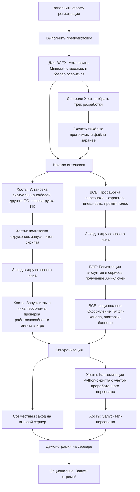

# План интенсива по созданию AI-стримерши

> **Цель:** Запустить собственного ИИ-персонажа с уникальной личностью — персонализированного автономного агента для прямых трансляций

Каждая команда запускает собственного AI-персонажа на основе готового бейзлайна!

Задача - повторить нашу инструкцию. Если вы впервые зашли сюда, начните с чтения [Вводных](#вводные), это обязательно, чтобы всё получилось!

## Вводные

В процессе знакомимся с **Twitch API**, **VTube Studio**, **виртуальными аудиокабелями**, **AI DevOps** по технической части, по софтам - создание образа персонажа, промпт-инжиниринг.

**Название** команды - ник вашего ИИ-персонажа.

В каждой команде **обязательно** должен быть человек с ролью **Хост** — тот герой, кто запускает стримершу.

**Результат:** N уникальных AI-стримеров, работающих в реальном времени на одном Minecraft-сервере (где N - число команд, успешно прошедших интенсив).

### 👥 Роли участников

> В каждой команде **обязательно** должен быть **Хост** — человек, который запускает стримершу.

- работаем **индивидуально** по возможности
- в команде ТОЛЬКО если друзья/нет физической возможности быть хостом/есть другая супер-весомая причина.
- на одном человеке может быть несколько ролей;
- роли могут пересекаться.

| Роль | Описание | Основные задачи |
|------|----------|----------------|
| **🎯 Хост** | Запускает персонажа | Подготовка окружения, запуск всех систем |
| **🎨 Креативщик** | Креативный специалист | ImageGen, оформление каналов, PromptGen |
| **📝 Регистратор** | Учётные записи в сервисах | Создание Twitch-аккаунта, получение API-ключей, заполнение таблиц |
| **📹 Папарацци** | Документалист, нарезчик | Запись моментов со стрима, создание клипов, монтаж highlights |
| **👀 Наблюдатель** | Наблюдать за происходящим, комментировать | Просто весело провести время, посидеть с нами в игре, покомментировать персонажей |

### Схема



## Обязательная преподготовка ДЛЯ ВСЕХ

Карточка задачи:

| ID | Роли | Время | Опционально | Описание |
|-----|-----|-----|---|---|
| Prep | ВСЕ | 30м-2ч | Обязательно | Преподготовка |

> Пока что, если видите TODO в инструкциях, можно ориентироваться на [СТАРУЮ](docs/INTENSIVE_PLAN_OLD) схему.

Обращаем внимание, что вы заполняли форму [ПРЕДВАРИТЕЛЬНОЙ](https://forms.gle/cPXF1JUPXp2bSxTK7) регистрации (из поста в TG), здесь ниже будет ссылка на форму [ОСНОВНОЙ](https://docs.google.com/forms/d/1qnJxamwzLhPryon-uBwYUslJOP-KU-YltWA_G3pDvo8/edit) обязательной регистрации (но заполнять её лучше после выполнения пунктов ниже).

Перед интенсивом всем участникам обязательно нужно сделать следующее:

1. Определитесь с вашей РОЛЬЮ участника
2. Придумайте ваш собственный уникальный ник, если его нет
   - На английском, от 4 до 12 символов, только буквы и цифры
3. Придумайте ник вашему персонажу
4. Заполните [формочку](https://forms.gle/VxHGzWpPp7PaNec78) **ОСНОВНОЙ** регистрации
5. (*Крайне желательно*) Установите **Minecraft** с **модами** согласно инструкции и минимально освойтесь ([инструкция](docs/instructions/Minecraft))

    Поставьте необходимый модпак, попробуйте зайти на какой-нибудь сервер, освоить минимальные основы

## 1. Роль Хост: обязательная подготовка

Перед интенсивом нужно **ОБЯЗАТЕЛЬНО** заранее ВЫБРАТЬ **ТРЕК** ХОСТА и **СКАЧАТЬ** ТЯЖЕЛЫЕ ФАЙЛЫ, об этом сейчас тут расскажу. Иначе не успеете к финалу интенсива `:(`

Так как участник под ролью хоста запускает у себя ИИ-персонажа, нужно иметь подходящее для этого устройство. Минимальные системные требования:

- Более 10G RAM
- Место на диске более 50 G
- Интернет не медленнее 10 мегабит
- OS: мы пробовали на маке, винде и линуксе, можно везде, НО проще всего на винде, а на маке можно потерять часть функций с Rich TTS.

### 1.1 Выбрать трек хоста заранее

| ID    | Роли | Опционально | Описание         |
|-------|------|-------------|------------------|
| 1.1   | Хост | Обязательно | Выбрать трек     |

Выберите трек разработки исходя из спеков вашего компа или ноута.

> [!CAUTION]
> Это ТРЕК для роли ХОСТА, не путать с РОЛЯМИ участников!

Таблица треков:

| Трек | Фичи | Требования |
|---|---|---|
| **1. Standart** | Игровой персонаж, простой TTS и STT, LLM по API | Минимальные требования |
| **2. Rich** | **Интонационный TTS**, простой STT, LLM по API. Рекомендуемый трек, т.к. вы сможете легко кастомизировать ГОЛОС вашего персонажа! | GPU с VRAM более **4G**, поддержкой CUDA 12+ |
| **3. Ultra** | **Локальная ролевая LLM**, Интонационный TTS, простой STT  | **NVIDIA** GPU с VRAM **16G** и более |
| **4. Maximus** | Локальная ролевая LLM, Интонационный TTS, **Качественный** STT | NVIDIA GPU с VRAM **25G** и более |

### 1.2 Скачайте заранее

| ID | Роли | Время | Опционально | Описание |
|-----|-----|-----|---|---|
| 1.2.1 | Хост | 10-30м | Обязательно |  |

Сначала можете просто накачать установщиков и программ.

1.2.1 Базовые программы:

- Если нет архиватора, скачайте [7-zip](https://www.7-zip.org/)
- [Виртуальные кабели](https://vb-audio.com/Cable/) под мак и винду
- [VTube Studio](https://store.steampowered.com/app/1325860/VTube_Studio/) из [Steam](https://store.steampowered.com/about/)
  - Также удостовертесь, что есть стимовский аккаунт
- [OBS](https://obsproject.com/)

1.2.2 Для треков выше Standart:

| ID | Роли | Время | Опционально | Описание |
|-----|-----|-----|---|---|
| 1.2.2 | Хост, ТРЕКИ выше Standart - Rich/Ultra/Maximus | | Обязательно |  |

- Nvidia Cuda [12.9](https://developer.nvidia.com/cuda-12-9-0-download-archive) 3.1 G
- Nvidia [CuDNN 9.15](https://developer.nvidia.com/cudnn-9-15-0-download-archive) 700 MB
- Docker Desktop

### 1.3 Установите программы

| ID | Роли | Время | Опционально | Описание |
|-----|-----|-----|---|---|
| 1.3 | Хост | | Обязательно | Устанавливаем программы |

### 1.3.1

| ID | Роли | Время | Опционально | Описание |
|-----|-----|-----|---|---|
| 1.3.1 | Хост | | Обязательно |  |

- Установите виртуальный звуковой кабель ([Windows](docs/instructions/VirtualAudioCable-Windows), [Mac](docs/instructions/VirtualAudioCable-Mac), [Linux](docs/instructions/VirtualAudioCable-Linux))
  - **КРИТИЧНО: ПЕРЕЗАПУСТИТЕ КОМП ПОСЛЕ УСТАНОВКИ!!!**
- VTube Studio установите из Steam
- Установите мод AutoClef на Minecraft в папку mods ([инструкция](docs/instructions/Minecraft#основной-мод-autoclef))
  - (в идеале) Базово освойтесь с ним

<details><summary>Если ставили CUDNN для WINDOWS (КРИТИЧНО!)</summary>

Нужно добавить CUDNN в Path (переменные среды и путь) Windows, как правило установщики Nvidia этого не делают как нужно!!
Если этого не сделать, будут проблемы с запуском STT модели на CUDA.

как добавить база есть тут <https://remontka.pro/add-to-path-variable-windows/>

в PATH нужно добавить путь к bin от cudnn:

`C:\Program Files\NVIDIA\CUDNN\v9.15\bin\12.9`

ИЛИ

`C:\Program Files\NVIDIA GPU Computing Toolkit
\CUDNN\v9.15\bin\12.9`

(перейдите в папку и проверьте какой у вас вариант, та папка, которая существует - та и правильная)

</details>

#### 1.3.2 Для треков выше Standart

| ID | Роли | Время | Опционально | Описание |
|-----|-----|-----|---|---|
| 1.3.1 | Хост, треки ВЫШЕ Standart | | Обязательно |  |

Если не установлен Docker:

Ранее вы скачали Docker (если следовали инструкции), установите его и перезапуститесь после установки.

Теперь скачаем заранее образ для нашего крутого интонационного TTS

```bash
docker pull fishaudio/fish-speech:v1.5.1-dev`
```

## Интенсив

Дальнейший план интенсива доступен по ссылке [здесь](docs/INTENSIVE_PLAN).
