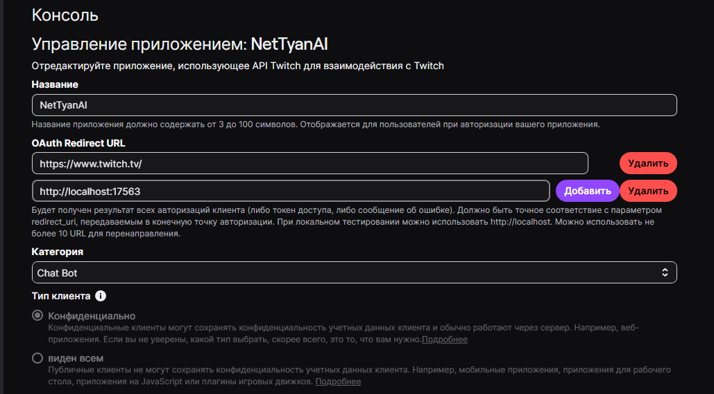

# Подключение API сервисов

> **Важно:** Подробная настройка описана в `.env.example` файле Python-скрипта

Здесь примерные и предварительные инструкции, но API ключи вы можете получить заранее, если ещё нет доступа к репозиторию со скриптом.

## 🎮 Twitch API

**Получение токена:**

1. Перейти в [Twitch Developer Console](https://dev.twitch.tv/console/apps)
2. Создать новое приложение (New Application)
3. Указать OAuth Redirect URL: `http://localhost:17563`
4. Скопировать Client ID и Client Secret, они поднабятся далее



Далее в `.env` Python-скрипта указать:

```dosini
# .env, private
TWITCH_APP_SECRET=""  # ваш Client Secret
TWITCH_APP_ID=""  # Ваш Client ID
TWITCH_TARGET_CHANNEL="nettyan_ai"  # specify your twitch channel twitch.tv/yourchannel <--
```

При первом запуске скрипта, скрипт откроет браузер и потребует авторизацию через аккаунт twitch.

## 💸 DonationAlerts

**Получение токена:**

1. Войдите в [DonationAlerts](https://www.donationalerts.com/), например, через twitch.
2. Перейти в [настройки аккаунта](https://www.donationalerts.com/dashboard/general-settings/account)
3. Секретный токен → Показать токен → копируйте

В `.env` python-скрипта указать:

```dosini
DONATIONALERTS_TOKEN=""  # найденный токен
```

## 🤖 LLM API

В Python-скрипте модели и адреса подключения указывается через `.env` в формате LiteLLM и соответствующих API ключей, см. приложенный к скрипту `.env.example`. Через эти переменные буквально парой ctrl c ctrl v можно подключать провайдеры любых openai-совместимых моделей, и даже локальных (lm studio и ollama имеют openai-совместимый интерфейс).

### LM Studio (локально)

- **Требования:** 6+ GB VRAM (для Mac — 15+ GB RAM)
- **Плюсы:** Бесплатно, работает офлайн
- **Минусы:** Требует мощное железо
- **Скачать:** [lmstudio.ai](https://lmstudio.ai/)

### Mistral API

- **Плюсы:** Простая регистрация, нет строгих ограничений, работает из RU
- **Получить:** [console.mistral.ai](https://console.mistral.ai/), зарегать номер телефона

### Google Gemini API

- **Получить:** [Google AI Studio](https://aistudio.google.com/)
- **Требования:** EU/US прокси для подключения
- **Плюсы:** Бесплатный tier с хорошими лимитами
