# Minecraft 1.21 + моды

## 1️⃣ Установка Java

**ОБЫЧНО НЕ ТРЕБУЕТСЯ!**
*Пропускайте шаг и возвращайтесь, только если не запускается лаунчер, но обычно он предложит вам нужную версию сам!*

**Требуется:** Java 21

- **Windows/Linux:** [Oracle JDK 21](https://www.oracle.com/java/technologies/downloads/#java21) или [Adoptium](https://adoptium.net/)
- **Проверка:** Открыть терминал и выполнить `java -version`

## 2️⃣ Установка Minecraft

Скачайте и установите майнкрафт любым удобным способом, для ознакомления со способами есть такой [гайд](https://cq.ru/articles/gaming/kak-skachat-minecraft-na-pk).

Проще всего будет с русским аналогом Prism лаунчера Minecraft - Freesm для удобной загрузки с территории России, так как с заходом на официальный сайт и покупкой из России могут быть проблемы. Некоторые используют TLauncher, с ним тоже не должно быть проблем.

> Но обращаем ваше внимание, что это неофициальные лаунчеры, и всегда лучше приобрести [лицензионную](https://www.minecraft.net/ru-ru/store/minecraft-java-edition) копию легендарной игры/

Когда запустите лаунчер и будет выбор версии, обратите внимание на версию!

Если отображаются мод-системы (например, 1.21 Fabric) - значит, выбирайте сразу Fabric

**Версия:** **Minecraft 1.21** (НЕ 1.21.10, НЕ 1.21.1, НЕ 1.21.X, НЕ 1.20!)

**Никнейм:** допустима латиница и цифры, желательно указывайте своего ИИ-персонажа. От 5 До 15 символов, не сильно очевидный по типу Apple (т.к. с него уже могут зарегистрироваться).

## 3️⃣ Установка Fabric

*Пропустите шаг, если уже в лаунчере выбрали версию 1.21 Fabric! Если просто 1.21 (без Fabric), то делайте этот шаг.*

**Fabric** — система модов для Minecraft

1. Скачать [Fabric Installer](https://fabricmc.net/use/installer/)
2. Запустить, выбрать версию **1.21**
3. Нажать Install

## 4️⃣ Установка модов

Запустите игру для теста, и чтобы игра создала нужные подпапки по типу `mods` (но если не создаст, вы можете создать сами потом).

При первом запуске для удобства можете указать язык

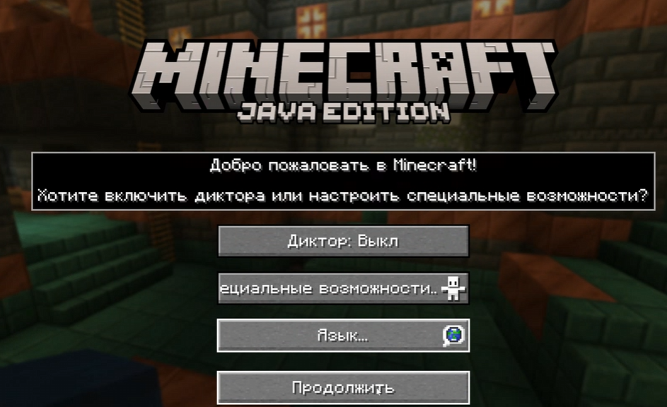

и дальше жмите Продолжить.

Чтобы узнать папку игры точно, можно зайти в игру, нажать Options (Настройки) → Resource Packs (Ресурс-паки) → Open Pack Folder (Открыть папку с паками) → подняться на уровень выше (из папки resourcepacks) → вы в папке игры!

Запомните ПАПКУ установки самой игры (НЕ ЛАУНЧЕРА!).

Папка игры обычно находится здесь:

- **Windows:** `%appdata%\.minecraft\mods`
- **Linux:** `~/.minecraft/mods`

### Основной мод: AutoClef

1. Скачать [последний релиз AutoClef](https://github.com/3ndetz/autoclef/releases/latest)
2. Поместить `.jar` файл в папку `mods` игры:

Запомните путь к конфиг-файлам: `папка игры/altoclef/`

### Необходимые моды

Нужно пройтись по ссылкам и скачать `.jar` файл каждого мода и кинуть в папку `mods`. Если автоматически не указалось, нужно выбрать Fabric 1.21 при скачивании.

С доступом к ModRinth (на него ведут ссылки) с территории РФ могут быть проблемы, если они есть, можете запустить под прокси или использовать CurseForge.

- [Cloth Config](https://modrinth.com/mod/cloth-config/versions?version=1.21&loader=fabric#download)
- [IAS (Ingame Account Switcher)](https://modrinth.com/mod/in-game-account-switcher/versions?version=1.21&loader=fabric#download)
- [ModMenu](https://modrinth.com/mod/modmenu/versions?version=1.21&loader=fabric#download)
- [No Peeking](https://modrinth.com/mod/nopeeking/versions?version=1.21&loader=fabric#download)
- [OkZoomer](https://modrinth.com/mod/ok-zoomer/versions?version=1.21&loader=fabric#download)
- [Fabric API](https://modrinth.com/mod/fabric-api/version/oGwyXeEI)
- [Simple Voice Chat](https://modrinth.com/mod/simple-voice-chat/versions?version=1.21&loader=fabric#download)
- [NoChatReports](https://modrinth.com/mod/no-chat-reports/versions?version=1.21&loader=fabric#download)

### Дополнительные моды (опционально)

Для оптимизации:

- [FerriteCore](https://modrinth.com/mod/ferrite-core/versions?version=1.21&loader=fabric#download)
- [ModernFix](https://modrinth.com/mod/modernfix/versions?version=1.21&loader=fabric#download)

Полезные утилиты для стримеров:

- [ChatPlus](https://modrinth.com/mod/chat-plus/versions?version=1.21&loader=fabric#download)
- [ReplayMod](https://modrinth.com/mod/replaymod/versions?version=1.21&loader=fabric#download)

Для улучшенных визуалов:

- [NotEnoughAnimations](https://modrinth.com/mod/notenoughanimations/versions?version=1.21&loader=fabric#download)
- [Physics Mod](https://modrinth.com/mod/physics-mod/versions?version=1.21&loader=fabric#download)
- [Player Animation Lib (Fabric)](https://modrinth.com/mod/player-animation-library/versions?version=1.21&loader=fabric#download)
- [Architectury](https://modrinth.com/mod/architectury-api/versions?version=1.21&loader=fabric#download)
- [Entity Model Features](https://modrinth.com/mod/entity-model-features/versions?version=1.21&loader=fabric#download)
- [Entity Texture Features](https://modrinth.com/mod/entitytexturefeatures/versions?version=1.21&loader=fabric#download)
- [Fabric Language Kotlin](https://modrinth.com/mod/fabric-language-kotlin/versions?version=1.21&loader=fabric#download)
- [FirstPerson](https://modrinth.com/mod/first-person-model/versions?version=1.21&loader=fabric#download)

## 5️⃣ Сервера

1. Запустить игру, где установили моды (Minecraft 1.21 с Fabric)
2. Multiplayer → Add Server
3. Ввести адрес сервера (IP цифрами, либо домен буквами). Некоторые сервера ещё требуют порт, например `serverip:port`.
Никаких пробелов после адреса быть не должно!

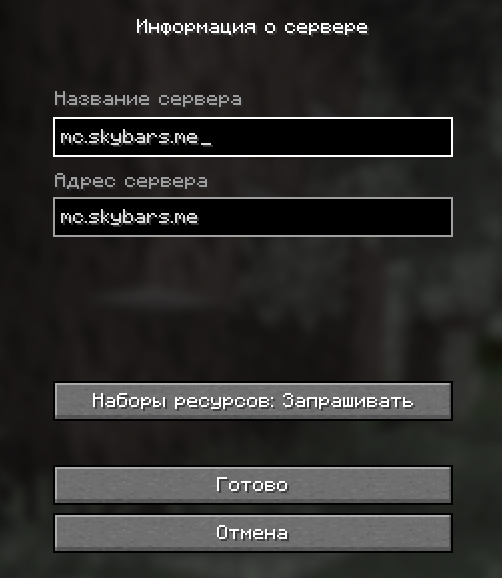

Несколько серверов, на которых можно побегать-проверить. Это не реклама!

- mc.skybars.me
  - Там работает VoiceChat
- mc.musteryworld.top
  - Есть поддерживаемые миниигры, например `@game bedwars` или `@game skywars`, но предварительно желательно зайти в нужное лобби.

## Основы Minecraft Multiplayer

### 1. Чат

- Для чего: Через него происходит общение в чате и все команды
- Открыть чат: обычно открывается на кнопку T, команды вводятся в чат с префиксом `/`, для удобства можно прямо открывать чат через кнопку `/`, и введётся префикс команды, например `/spawn`.
- На серверах выживания и минииграх по типу BedWars есть разделение на командный и общий чат (либо локальный / глобальный). Чтобы все увидели ваше сообщение, вначале нужно ввести префикс `!`, например `!Привет всем!` выведет `Привет всем!` в общий чат.

### 2. Лобби

На больших серверах при заходе вы попадаете в лобби, откуда нужно выбрать нужный сервер.

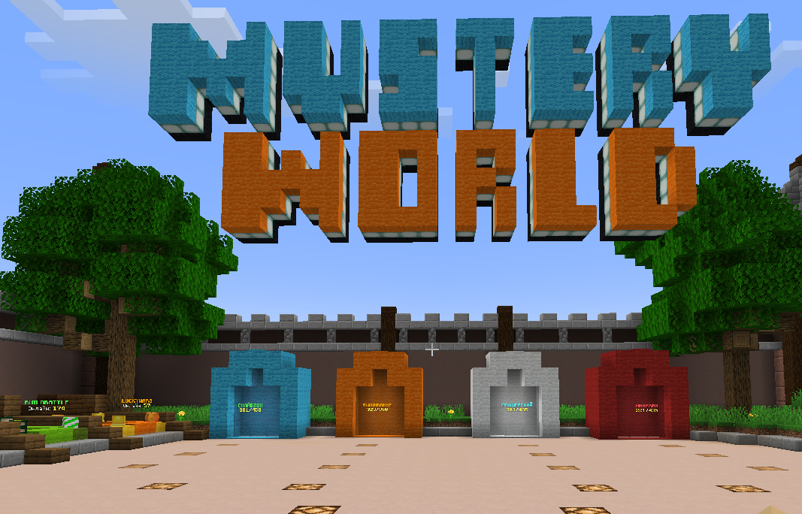

В лобби обычно есть порталы или NPC-персонажи.
Логично, зайдя в портал - вы попадёте в соответсвующую часть сервера.

Так, например, выглядят порталы для миниигр на MusteryWorld (нужно прыгнуть в воду):

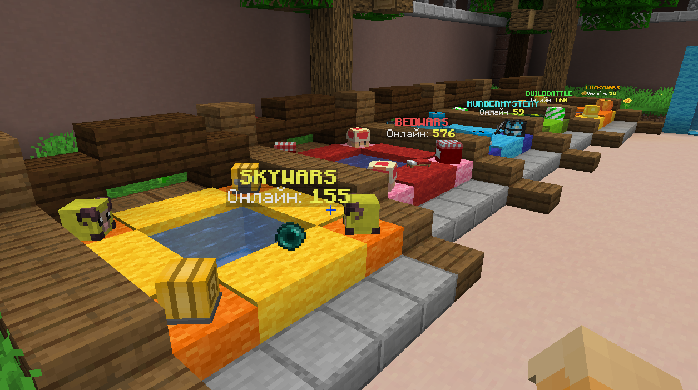

Часто в роли порталов могут быть NPC-персонажи, на которых нужно навестись и кликнуть ПКМ (Правой Кнопкой Мыши). Может открыться меню выбора, или вас сразу телепортирует.

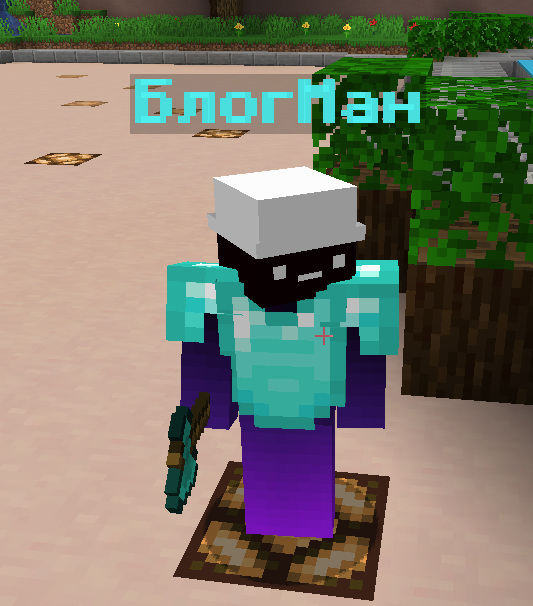

### 3. Меню

Также на серверах часто есть меню-предметы, выбрав нужный слот колёсиком мыши и кликнув ПКМ (Правой Кнопкой Мыши) можно открыть меню, в котором кликом можно выбрать нужную опцию

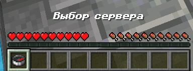

## 6️⃣ Команды

### Команды сервера

- Зарегистрироваться: `/register <пароль> <пароль>`
  - Каждый сервер запоминает ваш никнейм и новый пароль на нём, при входе ВПЕРВЫЕ попросит вас зарегистрироваться. Не забудьте записать или запомнить пароль!
  - Если вы входите на сервер ВПЕРВЫЕ, но вам просят войти (/login), значит игрок с вашим никнеймом УЖЕ зарегистрирован, и вам нужно сменить ник на другой, более "неочевидный".
- Войти: `/login <пароль>`
- `/spawn` — телепорт на спавн
- `/tpa <ник>` — запрос телепортации к игроку
- `/tell <ник> <сообщение>` — личное сообщение
- `/rtp` — телепорт в случайное место (если сервер поддерживает)
- `/warp` <название> — телепорт на варп (если сервер поддерживает)

### Команды бота (AutoClef)

- `@stop` — остановить текущую задачу
- `@punk` — режим свободного поведения
- `@game` — игровой режим
- `@help` — список всех команд

## 7️⃣ **Настройка голосового чата:**

Voice Chat + TTS

Зайдите на какой-нибудь сервер с поддержкой VoieChat, например, mc.skybars.me

При заходе в игру вам высветятся настройки VoiceChat, по умолванию открываются на клавишу "V" (нажмите на эту кнопку, если настройки сами не высветились при заходе).

Итак, у вас открылся помощик автонастройки Voice Chat, жмём Далее

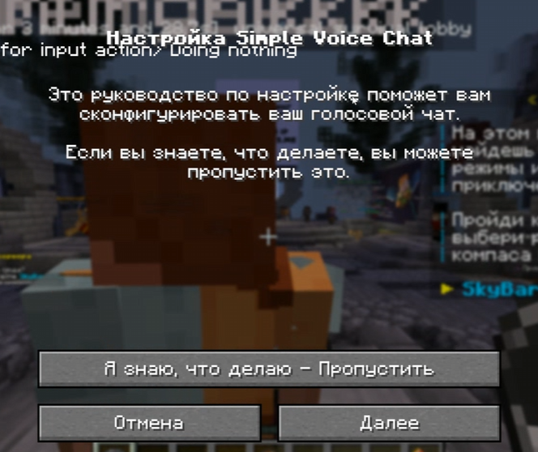

Динамик - туда, куда будет выдаваться голоса игроков, может быть динамиком или наушниками... Я обычно ставлю Default

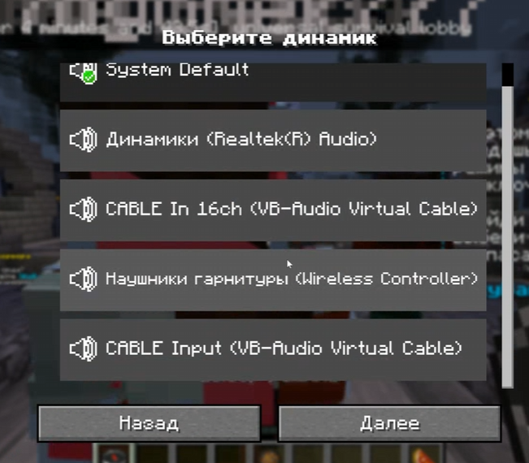

Микрофоне - ваш виртуальный кабель

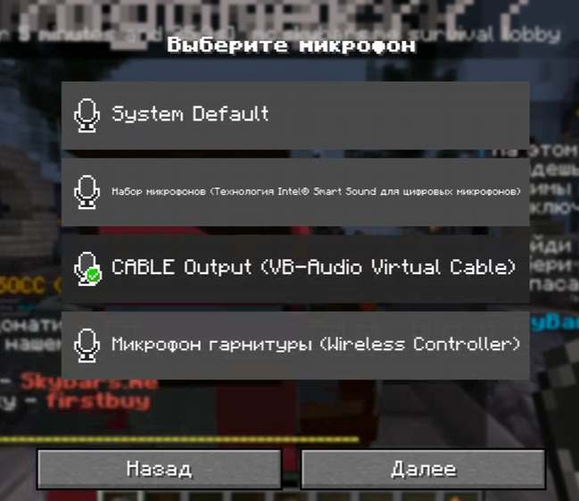

Способ говорить - голосовая аутивация - далее

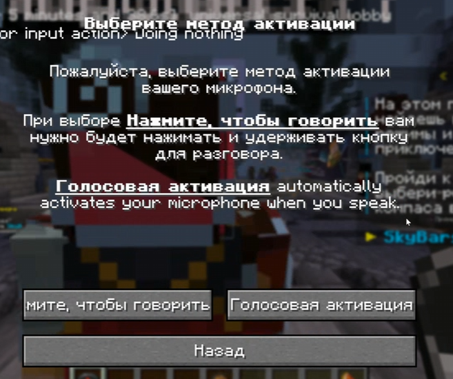

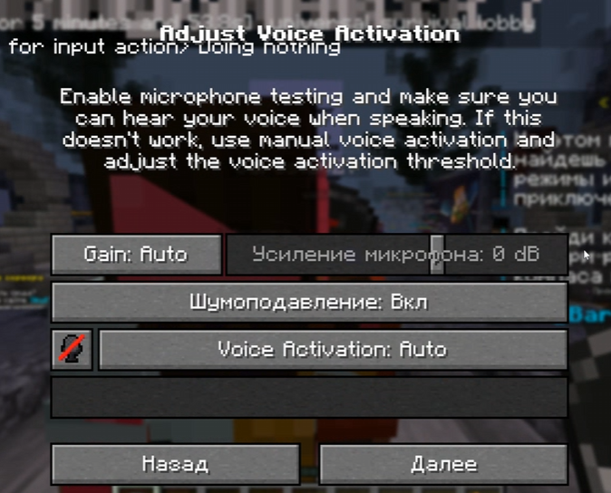

Завершить настройку.

Чтобы что-то изменить, нажмите ещё раз "V".

Не забудьте нажать на иконку микрофона, чтобы он остался включенным! (не должен быть перечёркнут)

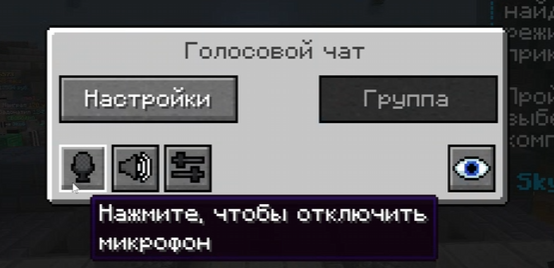

## Дополнительно: конфиг-файлы AutoClef

На этапе установке вы запомнили папку для конфигов, немного пройдёмся по важным настройкам:

`altoclef/configs/butler.json`:

- multiplayer_password` - можно указать свой пароль который игрок регает на серверах через /register, чтобы оно могло заходить само.

ну и в целом там есть важные ещё конфиги, например:

- `altoclef_settings.json/mobDefense` можно отключить автоматическую защиту от мобов и т.д., там много всего

В целом названия параметров обычно говорят сами за себя.
