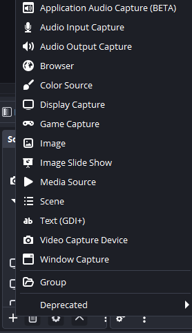
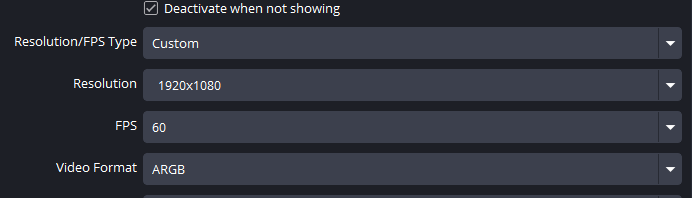
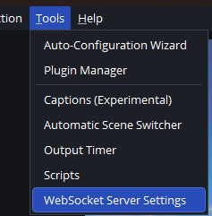
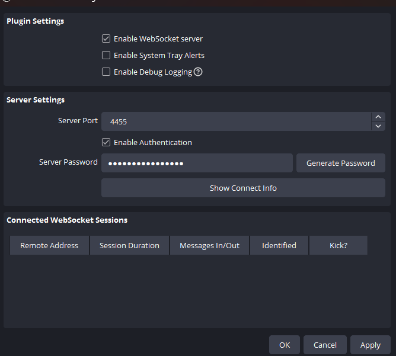

# 🎥 Настройка OBS Studio

> **Время:** 5–20 минут  

---

## 📥 Установка

1. Скачайте OBS Studio: [obsproject.com](https://obsproject.com/)
2. Запустите установщик и следуйте инструкциям
3. При первом запуске выберите **"Оптимизировать для стриминга"**

---

## 🎮 Подключение VTube Studio

### VTube Studio Virtual Camera

1. В VTube Studio включите **"Virtual Webcam"** и оставьте VTube Studio работать в фоне. [Инструкция по виртуальной камере](./VtubeModel.md#-виртуальная-веб-камера).

**В OBS:**
2. **"Источники"** → **"+"** → **"Устройство захвата видео"** (Video Capture Device)
3. Создайте источник `VtubeStudioCam`

**Настройки:**

- **Устройство:** `VtubeStudioCam`
- **FPS:** 60
- **Формат видео:** ARGB

---

## 🎵 Настройка звука

### Основные источники звука

1. Откройте **"Настройки"** → **"Аудио"**
2. Настройте устройства:
   - **Микрофон:** Укажите виртуальный кабель для TTS
   - **Динамики:** Ваши наушники/колонки, где у вас звук игры

---

## 📺 Настройка стрима на Twitch

### Получение Stream Key

1. Перейдите на [twitch.tv](https://twitch.tv) и войдите в аккаунт
2. Нажмите на аватар → **"Панель управления автора"** (Creator Dashboard)
3. В левом меню выберите **"Настройки"** → **"Трансляция"** (Stream)
4. Скопируйте **"Ключ трансляции"** (Primary Stream Key)

### Настройка OBS

1. В OBS откройте **"Настройки"** → **"Трансляция"** (Stream)
2. **Сервис:** Twitch
3. **Ключ трансляции:** (Stream key) Вставьте скопированный из Twitch Stream Key
4. Нажмите **"ОК"**

---

## 🚀 Запуск стрима

1. Проверьте все источники в превью
2. Убедитесь, что звук работает (индикаторы в микшере)
3. Нажмите **"Начать трансляцию"** (Start Streaming)
4. Откройте свой канал на Twitch и проверьте картинку

---

## OBS Websocket Server

Для Python-скрипта, чтобы он мог управлять OBS.

1.

2.

В Python-скрипте пароль вставьте в `.env` в поле связанное с паролем (в `.env.example` должно быть указано)

---

## 🔗 Полезные ссылки

- [OBS Studio Documentation](https://obsproject.com/wiki/)
- [Twitch Creator Camp](https://www.twitch.tv/creatorcamp)
- [OBS Websocket](https://obsproject.com/kb/remote-control-guide)
