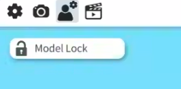
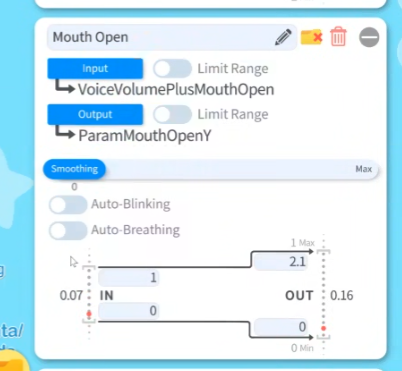
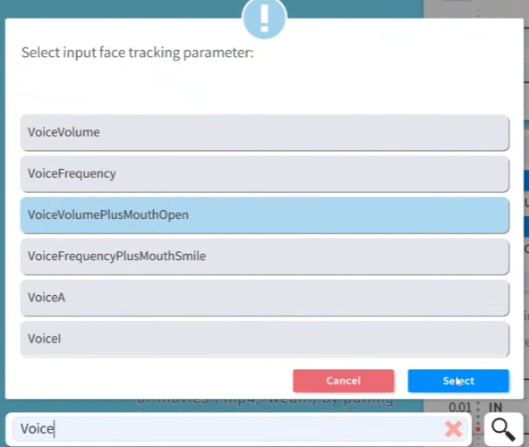
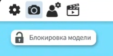
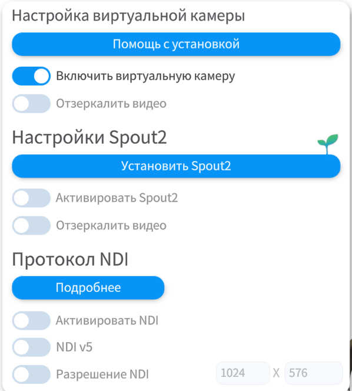
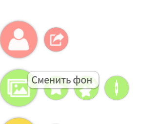
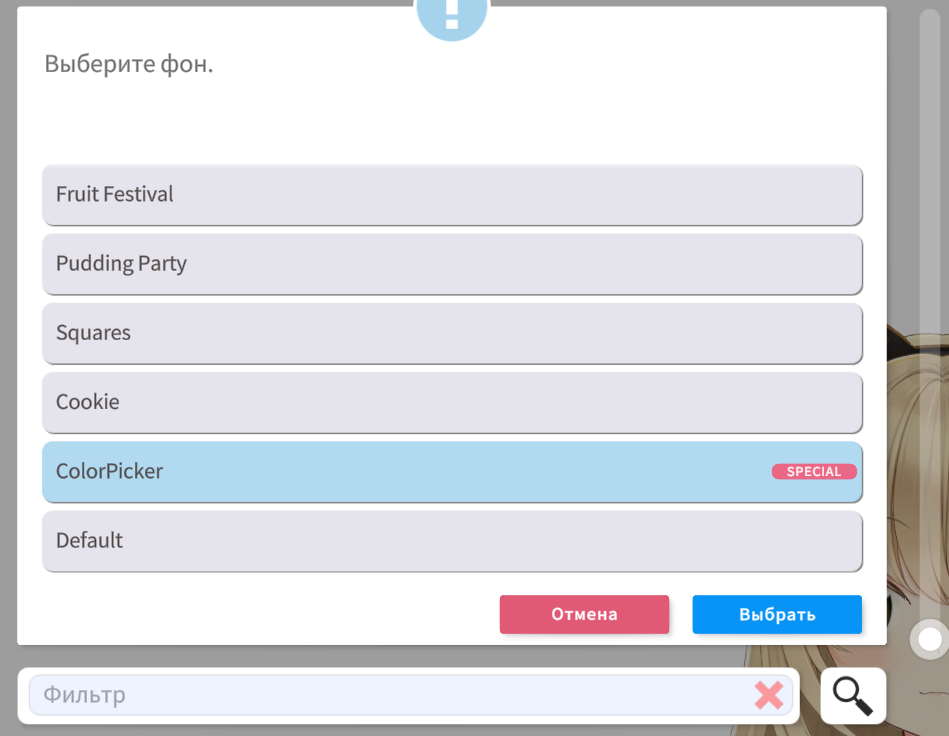
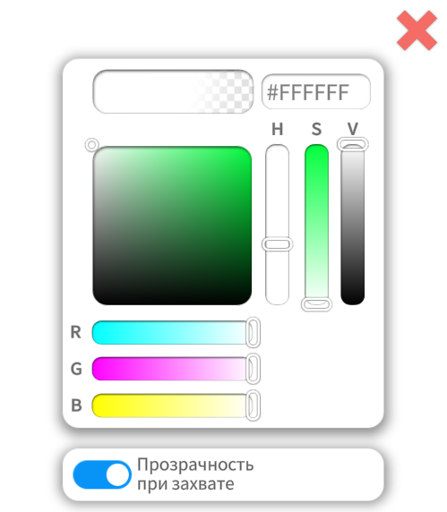
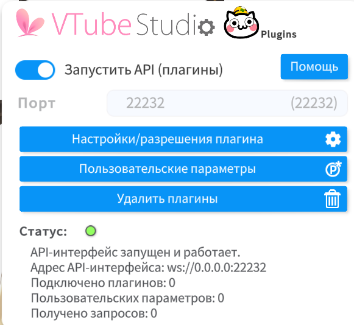

# 🎭 Настройка VTube Studio

> **Время:** 5–15 минут

---

## 📥 Установка

1. Скачайте VTube Studio:
   - **Windows/Mac:** [Steam](https://store.steampowered.com/app/1325860/VTube_Studio/) (бесплатно)
   - Для Linux можно через Steam и Proton (видел версию Proton-6.1-GE2, в стиме options/compatiblity)
2. Запустите приложение
Запустится сначала просто фон, надо подождать, потом:
Если пропал интерфейс, тыкнуть 2 раза на этот фон прямо в приложении, и появятся кнопки интерфейса.

---

## 🎨 Выбор модели

### Установка базовой модели

1. В главном меню нажмите на иконку **модели** (человечек)
2. Выберите одну из предустановленных моделей:
   - Легенда **Hiyori** — Neuro-Sama использовала эту модель в самом начале

---

## 🎤 Настройка lipsync (синхронизация губ)

### 1. Тестируем lipsink через ВАШ микрофон

1. Откройте настройки VTube Studio → доскролльте до **"Microphone"**
2. Выберите ваш микрофон из списка
3. Включите **"Microphone"** → **ON**
4. Настройте **чувствительность** (sensitivity) по необходимости

Модель должна шевелить губами в такт вашей речи.
Если этого не происходит, надо настраивать параметры самой 
модели на Voice, либо проверять микрофон.

### 1.1 Настройка параметров модели для синхронизации губ и голоса

Откройте настройки Vtube Studio.

Нажмите вот на этого персонажа с мелкой шестерёнкой сверху.

Пролистайте параметры до Mouth Open (также внизу по центру есть поиск по параметрам для удобства)

Нажмите Input. Выберите параметр VoiceVolumePlusMouthOpen

Select.

Когда всё работает, можно подключать виртуальный кабель (TTS).

### 2. Через виртуальный кабель (для TTS)

1. В настройках **"Microphone"** выберите:
   - **CABLE Output (VB-Audio Virtual Cable)**
2. Теперь голос наст будут двигаться под TTS-озвучку. Рот не будет и не должен открываться под ваш голос, он будет открываться под озвучку агента.

> 💡 **Подробнее о виртуальных кабелях:**  
>
> - Windows: [VirtualAudioCable-Windows.md](./VirtualAudioCable-Windows.md)  
> - Linux: [VirtualAudioCable-Linux.md](./VirtualAudioCable-Linux.md)

---

## 🎮 Виртуальная веб-камера

Настроим Virtual Camera для OBS:

1. Откройте настройки VTube Studio
2. Тыкните на иконоку камеры 📷

3. Скролльте почти в самый низ до **"Virtual Webcam Config"** (Настройка Виртуальной камеры)
4. Включите **"Start Virtual Webcam"**

   **Не сворачивайте** VTube Studio — оставьте работать на фоне

Теперь в OBS можно выбрать `VtubeStudioCam` как источник видео, вот [инструкция](./OBS.md#-подключение-vtube-studio) как это сделать в OBS.

Чтобы в OBS модель выводилась с прозрачным фоном, нужно сделать его прозрачным.

1. Жмём "сменить фон"

2. Листаем вниз, выбираем Color Picker

3. Ставим галку "Прозрачность при захвате"

---

## 🔧 Дополнительные настройки

---

## 🔌 Интеграция с Python-скриптом

Должно быть описано в доках самого скрипта, но в общих чертах дело обстоит так:

Шестёрнка и общие настройки, листаем до плагинов:

Включаем Запустить API. Порт: 22232.

Когда вы впервые запустите Python-скрипт, откройте Vtube Studio и разрешите плагину доступ, проставьте ему все галки.

## Загрузка дополнительных моделей

В Steam перейдите на страницу VTube Studio в библиотеке игр → Мастерская → Выберите модель, которая нравится → Подписаться

Когда подписались, в VTube Studio:

Возле шестерёнки ждём на значок Steam → Download model (загрузиь модель) → Жмём на **Фильтр (Filter)** → Указываем "ранее загруженный или отслеживаемый контент" (only previously downloaded/subscribed content) → выбираем модель и жмём ок, она будет загружаться.

---

## ❓ Частые проблемы

### Губы не двигаются

- Убедитесь, что lipsync включён
- Проверьте выбранный микрофон/кабель
- Увеличьте чувствительность в настройках

---

## 🔗 Полезные ссылки

- [VTube Studio Official](https://denchisoft.com/)
- [VTube Studio API](https://github.com/DenchiSoft/VTubeStudio)
- [VRoid Hub](https://hub.vroid.com/) — библиотека моделей
- [VRoid Studio](https://vroid.com/studio) — создание своих моделей
